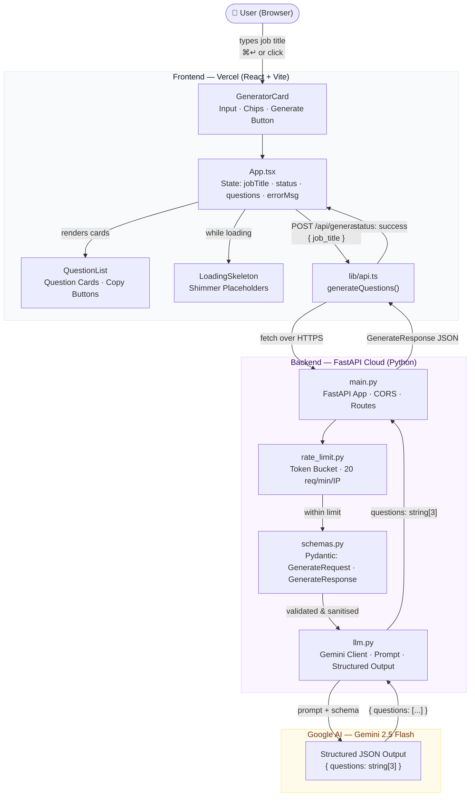
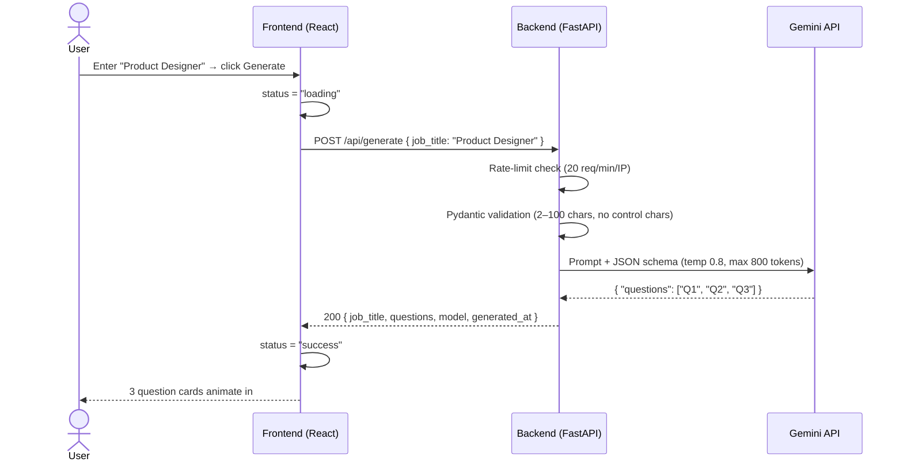

# InterviewGenie

> Generate 3 thoughtful, role-specific interview questions from any job title — powered by Gemini AI.

**Live:** [interveiw-gene.fastapicloud.dev](https://interveiw-gene.fastapicloud.dev) (API) · Frontend on Vercel

---

## System Architecture



---

## Request Flow (Happy Path)



---

## Project Structure

```
inter-Gen/
├── backend/
│   ├── app/
│   │   ├── main.py        # FastAPI app, routes, CORS, error handlers
│   │   ├── schemas.py     # Pydantic request/response models
│   │   ├── llm.py         # Gemini client, system prompt, structured output
│   │   ├── config.py      # Settings from env vars (pydantic-settings)
│   │   └── rate_limit.py  # In-memory token bucket (20 req/min/IP)
│   ├── tests/
│   │   └── test_api.py
│   ├── requirements.txt
│   └── .env.example
│
├── frontend/
│   ├── src/
│   │   ├── components/
│   │   │   ├── GeneratorCard.tsx   # Input, chips, generate button
│   │   │   ├── QuestionList.tsx    # Result cards with copy buttons
│   │   │   └── LoadingSkeleton.tsx # Shimmer placeholders
│   │   ├── lib/
│   │   │   └── api.ts              # fetch wrapper → /api/generate
│   │   ├── App.tsx                 # Root: state model + layout
│   │   └── main.tsx
│   ├── index.html
│   ├── tailwind.config.js
│   └── vite.config.ts
│
└── README.md
```

---

## Local Development

### Backend

```bash
cd backend
python -m venv .venv && source .venv/bin/activate
pip install -r requirements.txt
cp .env.example .env          # fill in GEMINI_API_KEY
uvicorn app.main:app --reload --port 8000
```

```bash
curl http://localhost:8000/api/health   # → {"status":"ok"}
```

### Frontend

```bash
cd frontend
npm install
npm run dev                   # proxies /api → localhost:8000
```

Open [http://localhost:5173](http://localhost:5173).

---

## Environment Variables

### Backend

| Variable | Required | Default | Description |
|---|---|---|---|
| `GEMINI_API_KEY` | Yes | — | Google AI Studio key. Never exposed to client. |
| `GEMINI_MODEL` | No | `gemini-2.5-flash` | Gemini model ID. |
| `ALLOWED_ORIGINS` | No | `http://localhost:5173` | Comma-separated CORS origins. |
| `LOG_USER_INPUT` | No | `false` | Set true only for local debugging. |

### Frontend

| Variable | Required | Description |
|---|---|---|
| `VITE_API_BASE_URL` | Yes (prod) | Backend base URL. Omit in dev (Vite proxy handles it). |

---

## API Reference

| Method | Path | Body | Response |
|---|---|---|---|
| `GET` | `/api/health` | — | `{"status":"ok"}` |
| `POST` | `/api/generate` | `{"job_title":"string"}` | `{job_title, questions[3], model, generated_at}` |

---

## Deployment

| Layer | Host | Notes |
|---|---|---|
| Backend | [FastAPI Cloud](https://fastapicloud.com) | `fastapi deploy .` from `backend/` |
| Frontend | [Vercel](https://vercel.com) | Set `VITE_API_BASE_URL` in Vercel env vars |
| LLM | Google AI Studio | Free tier, no credit card |

---

## Error Handling

| Scenario | HTTP | User message |
|---|---|---|
| Empty / whitespace input | 400 | Client-side guard — submit disabled |
| Input > 100 chars | 400 | Friendly message, clipped in UI |
| Rate limit exceeded | 429 | "Too many requests. Wait a moment." |
| LLM timeout (> 15 s) | 504 | "Took too long. Please try again." |
| LLM upstream error | 502 | "AI service unavailable. Try again." |
| Network failure (client) | — | Inline error banner with Retry button |

---

## Design Decisions & Tradeoffs

**Single job title input (not full JD)** — Keeps the interaction fast and focused for v1. Full JD ingestion is the next natural feature.

**In-memory rate limiter** — Acceptable for a single-instance demo. Production would use Redis for shared state across instances.

**Gemini structured output** — `response_mime_type: "application/json"` with an enforced schema means we never need to parse free-form text, eliminating an entire class of parsing bugs.

**`temperature: 0.8`** — Enough creative variety across repeated calls without going off-task.

**Retry once on wrong count** — If Gemini returns ≠ 3 questions, the backend retries once before returning 502. Rare but possible.
